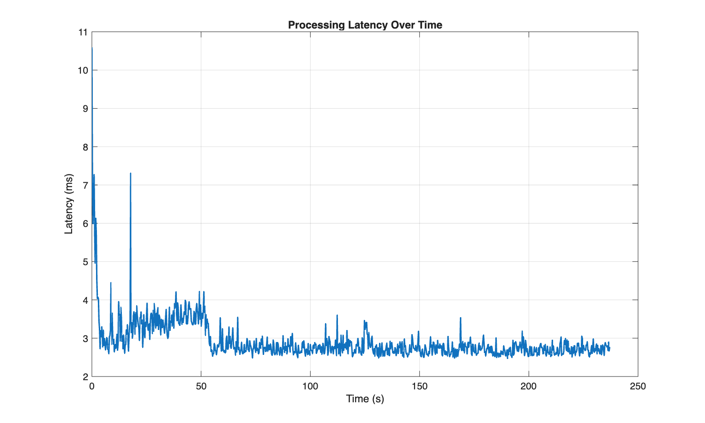

# Real-Time EEG Motor Imagery Decoding Simulation

This repository demonstrates a **real-time brain–computer interface (BCI) decoding pipeline** using EEG motor imagery data. It extends previous work from offline classification toward **latency-aware, streaming inference** using sliding windows.

## Project Evolution

This work is part of a structured progression:

1- [Baseline CSP pipeline](https://github.com/SanazRezvani/eeg-motor-imagery-csp)
 
2- [FBCSP extension](https://github.com/SanazRezvani/eeg-motor-imagery-fbcsp)  

### 3- **Current project:** Real-time decoding simulation

This work is based on **BCI Competition III – Dataset IVa**. Read the [Dataset description](https://www.bbci.de/competition/iii/desc_IVa.html)

---
## Objective

Most EEG classification pipelines are evaluated offline using labelled trials. However, real-world BCI systems must:

- Process continuous EEG streams
- Generate predictions in real time
- Operate under latency constraints

This project simulates that transition by:

- Applying sliding window segmentation
- Performing real-time feature extraction and classification
- Evaluating Latency and System Feasibility
- Analysing temporal prediction behaviour

## Two-Phase Pipeline
### 1- Offline phase:
- Apply Filter Bank Common Spatial Pattern (FBCSP) and extract features across multiple sub-bands using labelled trials

### 2- Real-time simulation phase:
- Treat test trials as an incoming EEG stream
- Apply sliding windows
- Extract FBCSP features per window
- Generate predictions
- Log processing latency

## How to Run

- Download the dataset from [BCI Competition III – Dataset IVa](https://www.bbci.de/competition/iii/)

- Open MATLAB

- Start by loading one of the subjects. ` data_set_IVa_al.mat ` is chosen here.

- Run: ` run_realtime_simulation.m `

Inside `run_realtime_simulation.m`, you can modify:
``` 
config.dataset_path = 'data_set_IVa_al.mat';
config.spatial_filter = 'CAR';       % options: 'CAR', 'Low Laplacian', 'High Laplacian'
config.filter_order = 3;
config.train_ratio = 0.70;
config.num_csp_pairs = 1;
config.trial_length_s = 3.5;
config.window_length_s = 1.0;
config.step_size_s = 0.25;
config.classifier_type = 'KNN';      % options: 'LDA', 'SVM', 'KNN'
config.filter_bank = [8 12; 10 14; 12 16; 14 18; 16 20; 18 22; 20 24; 22 26; 24 28; 26 30];
```

## Sliding Window Design

- Window length	= 1.0 s
- Step size =	0.25 s
- Overlap	= 75%

This allows the system to generate predictions every 250 ms while using sufficient temporal context for feature extraction.

## Results
Observations
- Initial latency spike (~10 ms) due to system warm-up
- Stabilises around 2.6–3 ms
- Occasional small fluctuations

The system demonstrates strong real-time capability, as processing latency is significantly lower than the step size.




## Prediction Log
| WindowIndex | Time (s) | Predicted | True | Latency (ms) |
|-------------|----------|----------|------|--------------|
| 1 | 0.01 | 2 | 1 | 10.594875 |
| 2 | 0.26 | 1 | 1 | 7.09304166666667 |
| 3 | 0.51 | 1 | 1 | 5.99429166666667 |
| 4 | 0.76 | 1 | 1 | 6.52583333333333 |
| 5 | 1.01 | 1 | 1 | 7.26666666666667 |
| 6 | 1.26 | 1 | 1 | 5.82733333333333 |
| 7 | 1.51  | 1 | 1 | 4.95966666666667 |
| 8 | 1.76 | 1 | 1 | 6.1315 |
| 9 | 2.01 | 2 | 1 | 5.76120833333333 |
| 10 | 2.26 | 2 | 1 | 4.51675 |
| 11 | 2.51 | 2 | 1 | 4.0345 |
| 12 | 2.76 | 1 | 1 | 4.07366666666667 |
| 13 | 3.01 | 1 | 1 | 4.02595833333333 |
| 14 | 3.26 | 1 | 2 | 3.43941666666667 |
| 15 | 3.51  | 2 | 2 | 3.23741666666667 |
| 16 | 3.76 | 2 | 2 | 2.72808333333333 |
| 17 | 4.01 | 2 | 2 | 3.19816666666667 |
| 18 | 4.26 | 2 | 2 | 3.03316666666667 |
| 19 | 4.51  | 2 | 2 | 3.29754166666667 |
| 20 | 4.76 | 2 | 2 | 3.10691666666667 |
| 21 | 5.01 | 2 | 2 | 2.770625 |

Full log available here: [prediction_log.csv](results/prediction_log.csv)
